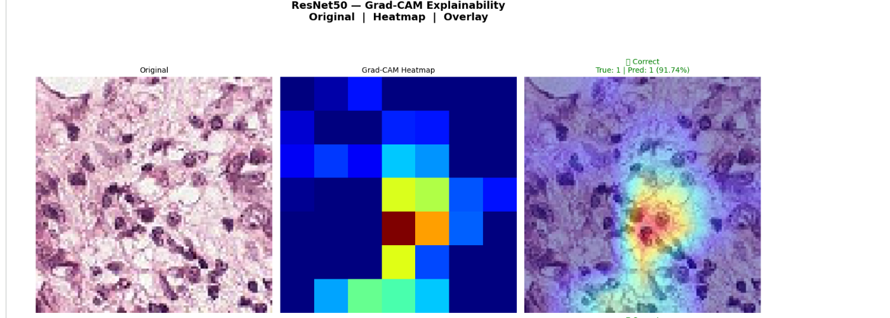
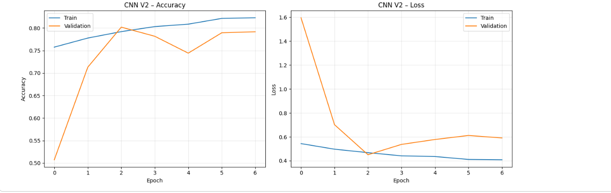
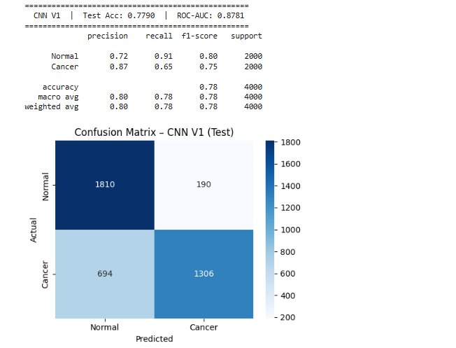
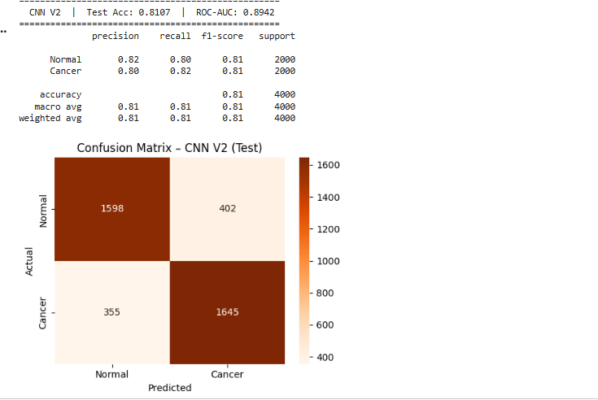
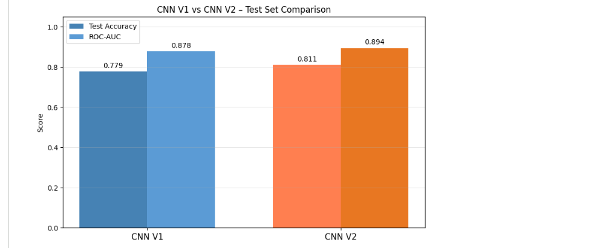
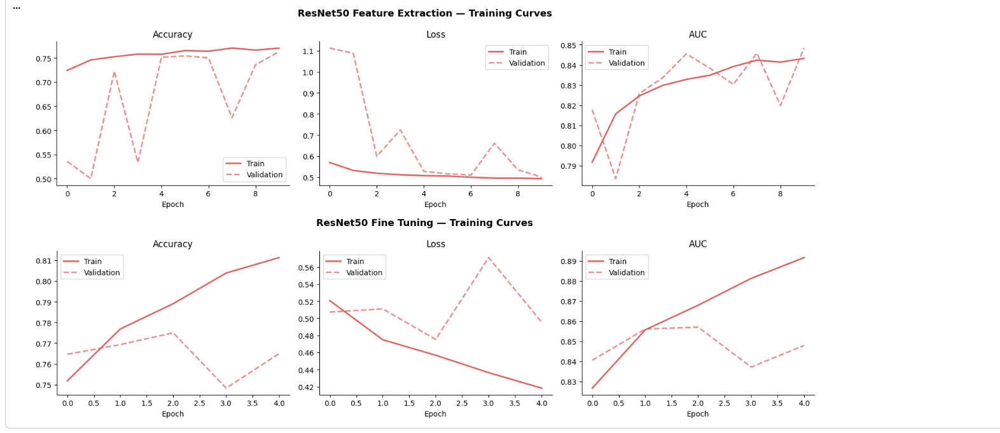
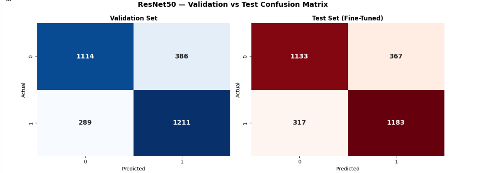
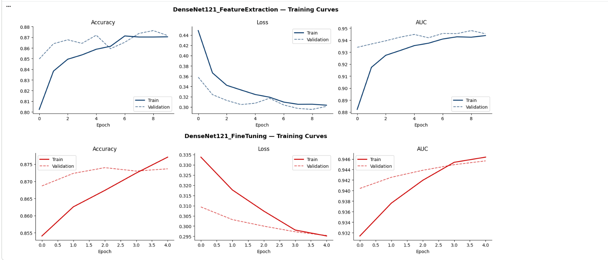
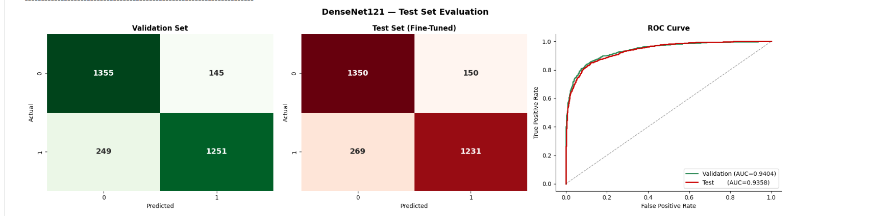

# Histopathologic Cancer Classification using Deep Learning (CNN)

Binary classification of histopathology image patches (cancerous vs. normal tissue) using custom CNNs and transfer learning (ResNet50, DenseNet121), built on the [Kaggle Histopathologic Cancer Detection](https://www.kaggle.com/competitions/histopathologic-cancer-detection) dataset (PatchCamelyon / PCam).

> Course project — Deep Learning in Healthcare

**Team:**
- Aditi Shivapurkar — UEC2023301
- Minal Chaudhari — UEC2023307
- Srishti Farande — UEC2023312
- Shruti Gavahane — UEC2023314

---

## Overview

Histopathology — the microscopic examination of tissue — is the gold standard for cancer diagnosis, but manual analysis is slow, expensive, and subject to inter-observer variability. This project trains and compares multiple CNN architectures to automatically classify 96×96 histopathology image patches as **Normal** or **Cancer**, from a shallow custom CNN baseline up to pretrained transfer-learning backbones (ResNet50, DenseNet121).

The model must generalize to unseen patches rather than memorize training samples — making regularization and proper evaluation (not just accuracy) critical in a medical context.

## Dataset

**Source:** [Kaggle — Histopathologic Cancer Detection](https://www.kaggle.com/competitions/histopathologic-cancer-detection) (PatchCamelyon / PCam)

| Property | Value |
|---|---|
| Total images (full dataset) | ~220,000 (96×96×3 RGB patches) |
| Sampled subset used | 20,000 (10,000 per class) |
| Class split | 50/50 — balanced via undersampling the majority class |
| Original patch size | 96×96×3 |
| Resized input (transfer learning models) | 224×224×3 |
| Label | `0` = Normal, `1` = Cancer |

The raw dataset is imbalanced (130,908 negative vs. 89,117 positive). The majority class is undersampled to match the minority class, then 10,000 samples per class are drawn for a balanced, computationally tractable training subset.

## Repository Structure

```text
histopathologic-cancer-classification/
│
├── notebooks/
│   ├── Custom_CNN.ipynb
│   ├── ResNet50.ipynb
│   └── DenseNet121.ipynb
│
├── outputs/
│   ├── Custom_CNN/
│   │   ├── training_curves_cnn_V1.png
│   │   ├── training_curves_cnn_V2.png
│   │   ├── confusion_matrix_cnn_v1_test.png
│   │   ├── confusion_matrix_cnn_v2_test.png
│   │   └── comparison_cnn_v1_vs_v2.png
│   │
│   ├── resnet50/
│   │   ├── resnet_training_curves.png
│   │   ├── resnet_confusion_matrix.png
│   │   └── gradcam_explainability.png
│   │
│   └── densenet121/
│       ├── training_curves.png
│       └── confusion_matrix_roc.png
│
├── report/
│   └── Histopathologic-Cancer-Classification-using-Deep-Learning-CNN.pdf
│
├── README.md
└── requirements.txt
```

## Pipeline

```
1. Input Image → 2. Preprocessing → 3. Model (Custom CNN / ResNet50 / DenseNet121) → 4. Training (single-phase for custom CNN, two-phase for transfer learning) → 5. Prediction → 6. Evaluation
```

Each stage is modular — preprocessing and model components can be swapped independently for experimentation. Custom CNNs (V1/V2) train in a single pass; the transfer-learning models (ResNet50, DenseNet121) train in two phases — feature extraction followed by fine-tuning — as described under [Models](#models).

## Preprocessing

1. **Download:** Data pulled via Kaggle API (`kaggle competitions download -c histopathologic-cancer-detection`).
2. **Undersampling:** Majority class downsampled to match minority class.
3. **Subsampling:** 10,000 images per class (20,000 total), stratified sampling, `random_state=42`.
4. **Splitting:**
   - Custom CNN notebook: 60% train / 20% val / 20% test (stratified)
   - Transfer learning notebooks (ResNet50, DenseNet121): 70% train / 15% val / 15% test (stratified)
5. **Resizing:** 96×96×3 → 224×224×3 for transfer learning backbones; custom CNNs trained near native resolution (94–96×94–96×3).
6. **Normalization:** Pixel values rescaled to `[0, 1]`.
7. **Augmentation (custom CNN only):** Random rotation (±20°), zoom (0.2), horizontal/vertical flip — training split only. Transfer-learning models were trained without augmentation (rescale only).
8. **Batch size:** 32 throughout.

## Models

### CNN V1 (Baseline)

```
Input (96×96×3)
 → Conv2D(32, 3×3, ReLU) → MaxPool2D
 → Conv2D(64, 3×3, ReLU) → MaxPool2D
 → Flatten → Dense(128, ReLU) → Dropout(0.25)
 → Dense(1, Sigmoid)
```

Minimal regularization (single dropout, no BatchNorm). Optimizer: Adam, lr = 1e-3. Trained max 10 epochs with EarlyStopping (patience=3, monitor `val_accuracy`); stopped early at epoch 7.

### CNN V2 (Improved)

```
Input (96×96×3)
 Block 1: Conv2D(32) → BN → Conv2D(32) → BN → MaxPool → Dropout(0.25)
 Block 2: Conv2D(64) → BN → Conv2D(64) → BN → MaxPool → Dropout(0.35)
 Block 3: Conv2D(128) → BN → Conv2D(128) → BN → MaxPool → Dropout(0.40)
 → GlobalAveragePooling2D
 → Dense(256, ReLU) → Dropout(0.50)
 → Dense(1, Sigmoid)
```

Adds BatchNorm after every conv layer, a third conv block, GlobalAveragePooling instead of Flatten (cuts params from ~3.98M to ~323K), and escalating dropout. Optimizer: Adam, lr = 1e-4. Trained max 15 epochs with EarlyStopping (patience=4, monitor `val_accuracy`).

### ResNet50 (Transfer Learning)

ResNet50 pretrained on ImageNet, used as a feature extractor with skip connections to avoid vanishing gradients.

```
Input (224×224×3)
 → ResNet50 backbone → GlobalAveragePooling2D (2048-d)
 → Dense(256, ReLU) → BatchNorm → Dropout(0.5)
 → Dense(128, ReLU) → Dropout(0.3)
 → Dense(1, Sigmoid)
```

**Two-phase training:**
1. **Feature extraction:** Backbone frozen, only custom head trained, 10 epochs, lr = 1e-3.
2. **Fine-tuning:** Last 20 ResNet50 layers unfrozen, 5 more epochs, lr = 1e-5.

Includes Grad-CAM visualization to interpret which image regions the model attends to.


*Grad-CAM overlay on a correctly classified cancer patch (True: 1, Pred: 1, 91.74% confidence) — the model's attention concentrates on the dense cell cluster, not background tissue.*

### DenseNet121 (Transfer Learning)

DenseNet121 pretrained on ImageNet — each layer receives feature maps from all previous layers within a dense block, improving gradient flow and feature reuse.

```
Input (224×224×3)
 → DenseNet121 backbone (4 dense blocks: ×6, ×12, ×24, ×16; growth rate k=32)
 → GlobalAveragePooling2D (1024-d)
 → Dense(256, ReLU) → BatchNorm → Dropout(0.5)
 → Dense(128, ReLU) → Dropout(0.3)
 → Dense(1, Sigmoid)
```

Same two-phase schedule as ResNet50: 10 epochs frozen-backbone feature extraction (lr = 1e-3) → 5 epochs fine-tuning with last 20 layers unfrozen (lr = 1e-5).

## Hyperparameters & Training Strategy

| Setting | Custom CNN (V1 / V2) | Transfer Learning (ResNet50 / DenseNet121) |
|---|---|---|
| Optimizer | Adam | Adam |
| Loss | Binary cross-entropy | Binary cross-entropy |
| Learning rate | 1e-3 (V1) / 1e-4 (V2) | 1e-3 (feature extraction) → 1e-5 (fine-tuning) |
| LR schedule | `ReduceLROnPlateau` (factor 0.5, patience 2, monitor `val_loss`) | `ReduceLROnPlateau` (factor 0.5, patience 3, monitor `val_loss`) |
| Batch size | 32 | 32 |
| Epochs | V1: max 10 / V2: max 15 | Feature extraction: 10 / Fine-tuning: 5 |
| Early stopping | Monitor `val_accuracy`, patience 3 (V1) / 4 (V2), restores best weights | Monitor `val_auc`, patience 5, restores best weights |
| Checkpointing | — | `ModelCheckpoint` saving best weights by `val_auc` |

A high initial learning rate (1e-3) speeds convergence when training a randomly initialized head; a much lower learning rate (1e-5) during fine-tuning avoids destroying pretrained ImageNet features. Early stopping with `restore_best_weights=True` prevents overfitting without manual epoch tuning.

## Evaluation Metrics

- **Accuracy** — overall correctness; can be misleading under class imbalance.
- **AUC (ROC Curve)** — threshold-independent measure of discriminative ability; treated as the most important metric for medical diagnosis.
- **F1-Score** — harmonic mean of precision and recall; important when minimizing false negatives (missed cancer cases) matters most.
- **Recall (Sensitivity)** — tracked explicitly since missing a cancer case is clinically more costly than a false alarm.
- **Confusion Matrix** — used to inspect false-negative / false-positive trade-offs for each model.

## Results

| Model | Accuracy | AUC | F1 Score | Recall |
|---|---|---|---|---|
| Custom CNN V1 (Baseline) | 77.90% | 0.878 | 0.75 | 0.78 |
| Custom CNN V2 (Improved) | 81.07% | 0.894 | — | 0.81 |
| ResNet50 (Fine-Tuned) | 77.20% | 0.857 | 0.776 | 0.789 |
| DenseNet121 (Fine-Tuned) | 87.93% | 0.948 | 0.877 | 0.863 |

**Best overall model: DenseNet121** — highest accuracy, AUC, and F1-score of all architectures tested.

### Detailed Phase Comparison

**ResNet50**

| Metric | Validation | Test |
|---|---|---|
| Accuracy | 0.7613 | 0.7720 |
| AUC | 0.8501 | 0.8572 |
| Recall | 0.6713 | 0.7887 |
| F1 Score | 0.7377 | 0.7757 |

**DenseNet121**

| Metric | Feature Extraction | Fine-Tuning |
|---|---|---|
| Accuracy | 0.8767 | 0.8793 |
| AUC | 0.9467 | 0.9483 |
| Recall | 0.8653 | 0.8633 |
| F1 Score | 0.8753 | 0.8774 |

| Metric | Validation (Fine-Tuned) | Test (Fine-Tuned) |
|---|---|---|
| AUC (ROC) | 0.9404 | 0.9358 |

### Custom CNN — Training Curves & Confusion Matrices










### ResNet50 — Training Curves & Confusion Matrix





### DenseNet121 — Training Curves & Confusion Matrix

DenseNet121 was the best-performing model, so its curves and confusion matrices are included directly below.


*Accuracy, loss, and AUC across both training phases. Validation tracks training closely with no major overfitting gap.*


*Validation and test confusion matrices (fine-tuned model) alongside the ROC curve — Validation AUC 0.9404, Test AUC 0.9358.*

## Key Insights

- **Custom CNN:** Limited depth and feature reuse capped performance — could not preserve fine features across many layers.
- **ResNet50:** Focuses on global shape learning via deep residual layers; histopathology relies more on micro-texture detection, which limited its relative performance here.
- **DenseNet121 (best performer):** Dense connectivity gives every layer access to all previous layers' features, preserving texture information well — captured subtle cancer patterns most effectively (highest AUC and F1).
- Transfer learning substantially outperforms training a CNN from scratch on this dataset size.
- Architecture choice matters more than depth alone — DenseNet121 outperformed the deeper ResNet50 due to its connectivity pattern, not raw layer count.

## Challenges Faced

- **Subtle data complexity:** Visual differences between cancerous and normal cells are extremely subtle, even for trained pathologists.
- **Limited image context:** 96×96 patches don't capture enough tissue organization context for harder cases.
- **Compute constraints:** Limited GPU access restricted model complexity and the extent of hyperparameter tuning.
- **Medical image variability:** Inconsistent staining and lighting across slides introduced noise that hurt generalization.

## Setup & Installation

```bash
git clone <your-repo-url>
cd histopathologic-cancer-classification
pip install -r requirements.txt
```

### Dataset Setup (Kaggle API)

1. Generate a Kaggle API token: Kaggle → Account → "Create New API Token" → downloads `kaggle.json`.
2. Place it and set permissions:
   ```bash
   mkdir -p ~/.kaggle
   cp kaggle.json ~/.kaggle/
   chmod 600 ~/.kaggle/kaggle.json
   ```
3. Download the competition data:
   ```bash
   kaggle competitions download -c histopathologic-cancer-detection -p ./pcam_raw
   ```

> Notebooks were originally written for Google Colab using `google.colab.files.upload()` for the Kaggle credential step — replace with the steps above for a local environment.

## How to Run

1. **Custom CNN (V1 & V2):** Run `notebooks/Custom_CNN.ipynb` top to bottom — downloads data, builds the balanced 20K subset, splits 60/20/20, trains both CNN versions, and produces confusion matrices + training curves.
2. **ResNet50:** Run `notebooks/ResNet50.ipynb` — builds a 70/15/15 split, trains the two-phase model, evaluates on val/test, and generates Grad-CAM visualizations.
3. **DenseNet121:** Run `notebooks/DenseNet121.ipynb` — same data pipeline as ResNet50, with the DenseNet121 backbone.

Each notebook is self-contained and regenerates its own data subset/splits with a fixed `random_state=42` for reproducibility.
